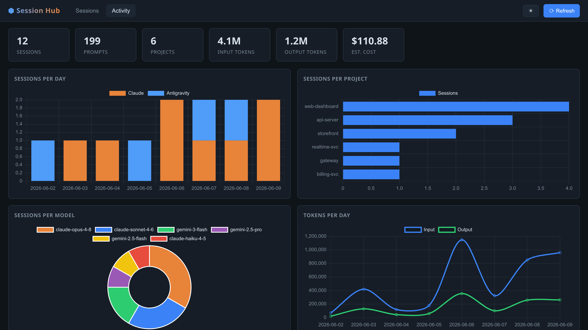

# Session Hub

[](https://github.com/parthcodex1177/session-hub/actions/workflows/ci.yml)

A local dashboard for **Claude Code** and **Antigravity CLI** session history.

Browse every past session, search your full prompt history with FTS, see token
usage and estimated API cost, tag important sessions, and resume old work —
all from a native desktop window or browser tab.


> _Activity tab — usage and cost analytics:_
>
> 
>
> _(Screenshots use sample data.)_

---

## Features

| Feature | Detail |
|---|---|
| Unified history | Claude Code + Antigravity indexed into one SQLite DB |
| Full-text search | FTS5 on every prompt — find "where did I fix that N+1 query" |
| Token → cost | Estimated API cost per session (Claude Opus/Sonnet/Haiku, Gemini families) |
| Session tagging | Tag sessions "important", "reference", etc. — filterable |
| Inline detail | Click a row to expand prompts, metadata, git commits — no navigation |
| Git diff view | Commits that landed during a session (lazy-loaded from `git log`) |
| Live badge | Green pulsing dot for sessions running right now; auto-refreshes every 30s |
| Resume | ▶ opens a terminal with `claude --resume <id>` or `agy --conversation <id>` |
| Export | Download filtered results as JSON or CSV |
| Activity charts | Sessions/day, per project, per model, tokens/day, estimated cost/day |
| Light / dark | Theme toggle, persisted in localStorage |
| Incremental scan | Only re-parses changed files (~80 ms warm) |

---

## Requirements

| | Linux | macOS | Windows |
|---|---|---|---|
| Python | 3.10+ | 3.10+ | 3.10+ |
| Native window | GTK3 + WebKit2GTK (`gir1.2-webkit2-4.0`/`4.1`) — **auto-installed** | built-in WKWebView | Edge WebView2 (Win 10/11) |
| Browser mode | ✅ any browser | ✅ any browser | ✅ any browser |
| Claude Code | optional | optional | optional |
| Antigravity CLI | optional | optional | optional |

---

## Install

### Linux (Ubuntu / Debian) — native app

```bash
git clone https://github.com/parthcodex1177/session-hub.git ~/tools/session-hub
~/tools/session-hub/install-app.sh
```

Adds **Session Hub** to the GNOME app grid and a `session-hub` command on PATH.
Search it in Activities or pin it to the dock.

The installer **auto-detects and installs** the native-window libraries
(PyGObject + GTK3 + WebKit2GTK — the right `gir1.2-webkit2-4.0`/`4.1` for your
release), prompting for your password if needed. Re-running `install-app.sh`
after `git pull` re-checks them, so updates stay self-healing. If you launch
from the GNOME icon on a fresh machine and the libs are missing, run
`session-hub` once in a terminal so it can install them.

Uninstall: `~/tools/session-hub/install-app.sh --uninstall`

### macOS — native app

```bash
git clone https://github.com/parthcodex1177/session-hub.git ~/tools/session-hub
~/tools/session-hub/run.sh --app
```

The first run creates a venv and installs pywebview (which uses the system
WKWebView — no extra installs needed). For a permanent launcher, create an
Automator app or alias: `alias session-hub='~/tools/session-hub/run.sh --app'`.

### Windows — native app

```
git clone https://github.com/parthcodex1177/session-hub.git %USERPROFILE%\tools\session-hub
%USERPROFILE%\tools\session-hub\install.bat
```

Creates a Desktop shortcut. Requires Edge WebView2 Runtime, which ships with
Windows 10 (1803+) and Windows 11.

### Any platform — browser mode

```bash
~/tools/session-hub/run.sh           # http://127.0.0.1:8788/
~/tools/session-hub/run.sh --port 9000
~/tools/session-hub/run.sh --scan-only   # index only, print summary
SESSION_HUB_PORT=9000 session-hub    # via installed command
```

---

## Data sources (read-only)

Session Hub **never writes** to your Claude or Antigravity data.

| Tool | Files read |
|---|---|
| Claude Code | `~/.claude/projects/*/*.jsonl`<br>`~/.claude/history.jsonl`<br>`~/.claude/sessions/*.json` (live status) |
| Antigravity | `~/.gemini/antigravity-cli/history.jsonl`<br>`~/.gemini/antigravity-cli/conversations/*.db` (model + step count) |

Index: `~/.local/share/session-hub/index.db` (Linux/macOS) or
`%LOCALAPPDATA%\session-hub\index.db` (Windows, if configured).

---

## Cost estimates

The **~$x.xx** figures use public API list prices and exclude cached tokens.
They are a ballpark, not a billing figure.

---

## Development

```bash
git clone https://github.com/parthcodex1177/session-hub.git
cd session-hub
python3 -m venv .venv && .venv/bin/pip install -e ".[dev]"
.venv/bin/pytest tests/ -v
.venv/bin/session-hub          # start server at http://127.0.0.1:8788/
```

See [CONTRIBUTING.md](CONTRIBUTING.md) for architecture notes.

---

## Documentation

- **[USAGE.md](USAGE.md)** — how to use every feature, keyboard shortcuts, troubleshooting
- **[FEATURES.md](FEATURES.md)** — complete feature reference
- **[CONTRIBUTING.md](CONTRIBUTING.md)** — architecture and how to add a new tool

---

## License

MIT — see [LICENSE](LICENSE).
