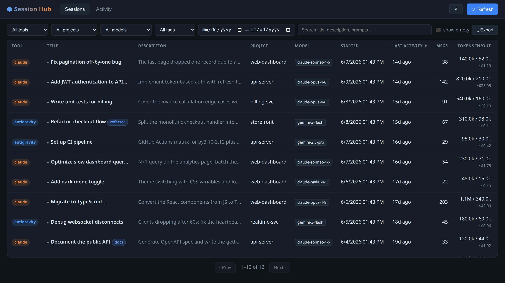

# Session Hub

A local dashboard for **Claude Code** and **Antigravity CLI** session history.

Browse every past session, see token usage and estimated cost, search your
prompt history, and resume old sessions — all from a native desktop window
or browser tab.



---

## Features

- **Unified history** — indexes Claude Code (`~/.claude/`) and Antigravity
  (`~/.gemini/antigravity-cli/`) into a single SQLite database.
- **Inline session detail** — click any row to expand the full description,
  metadata, and prompt timeline without leaving the page.
- **Token → cost estimate** — approximate API cost per session based on
  model pricing (Claude Opus/Sonnet/Haiku, Gemini 2.x/3.x families).
- **Live "running" badge** — detects sessions that are active right now via
  pid files + `/proc`.
- **Resume** — ▶ opens a terminal running `claude --resume <id>` or
  `agy --conversation <id>` in the session's project directory.
- **Incremental scan** — only re-parses files that changed since the last
  scan (~80 ms warm).
- **Activity charts** — sessions per day, per project, per model, tokens
  over time.

---

## Requirements

| Requirement | Notes |
|---|---|
| Python 3.10+ | |
| Ubuntu / Debian Linux | The native-window mode uses GTK + WebKit2GTK. |
| `gir1.2-webkit2-4.1` | Already present on stock Ubuntu GNOME. Install with `sudo apt install gir1.2-webkit2-4.1` if missing. |
| Claude Code **or** Antigravity CLI | At least one must be installed for there to be data to show. |

The browser mode (`run.sh`) works on macOS and any Linux desktop.
The native-window mode (GTK/WebKit) requires a Linux GTK session.

---

## Install (Ubuntu — recommended)

```bash
git clone https://github.com/your-username/session-hub.git ~/tools/session-hub
~/tools/session-hub/install-app.sh
```

This:
- Creates a Python venv with all dependencies (first run only, ~30 s).
- Adds a **Session Hub** entry to the GNOME app grid.
- Puts a `session-hub` command on your PATH.

Click the icon in Activities (or run `session-hub`) to open the dashboard.
Closing the window stops the app. Launching again while open is a no-op.

Uninstall:
```bash
~/tools/session-hub/install-app.sh --uninstall
```

---

## Run without installing

```bash
# native window (Linux GTK)
~/tools/session-hub/run.sh --app

# browser tab (any platform)
~/tools/session-hub/run.sh
# then open http://127.0.0.1:8788/

# scan only (no server)
~/tools/session-hub/run.sh --scan-only
```

Override the port: `SESSION_HUB_PORT=9000 ~/tools/session-hub/run.sh`

---

## Data sources (read-only)

Session Hub **never writes** to your Claude or Antigravity data.

| Tool | Files read |
|---|---|
| Claude Code | `~/.claude/projects/*/*.jsonl` — session history<br>`~/.claude/history.jsonl` — fallback metadata<br>`~/.claude/sessions/*.json` — live-session pid files |
| Antigravity | `~/.gemini/antigravity-cli/history.jsonl` — prompts & timestamps<br>`~/.gemini/antigravity-cli/conversations/*.db` — step count + model |

The index lives at `~/.local/share/session-hub/index.db`.

---

## Cost estimates

The **~$x.xx** figures are rough estimates based on public API list prices.
They **exclude** cached tokens (which cost less) and do not account for
discounts, credits, or enterprise pricing. Use them as a ballpark, not a
billing figure.

---

## Tests

```bash
cd ~/tools/session-hub
python3 -m venv .venv && .venv/bin/pip install -q -e .
.venv/bin/python -m pytest tests/ -v
```

---

## Project layout

```
session-hub/
├── sessionhub/
│   ├── config.py           # paths & constants
│   ├── db.py               # SQLite schema + connection
│   ├── parse_claude.py     # JSONL parser for Claude Code sessions
│   ├── parse_antigravity.py# history.jsonl + .db parser
│   ├── scanner.py          # incremental mtime-diff scan
│   ├── active.py           # live-session detection
│   ├── resume.py           # terminal launch (security boundary)
│   ├── desktop.py          # native GTK/WebKit window (pywebview)
│   ├── app.py              # FastAPI endpoints + static mount
│   └── static/             # index.html, app.js, style.css
├── tests/
├── assets/                 # icon (SVG)
├── install-app.sh          # Ubuntu desktop integration
├── session-hub-launch.sh   # smart launcher (single-instance, ready-file)
├── run.sh                  # quick-start for manual use
└── pyproject.toml
```

---

## Contributing

Bug reports and PRs are welcome. See [CONTRIBUTING.md](CONTRIBUTING.md).

---

## License

MIT — see [LICENSE](LICENSE).
